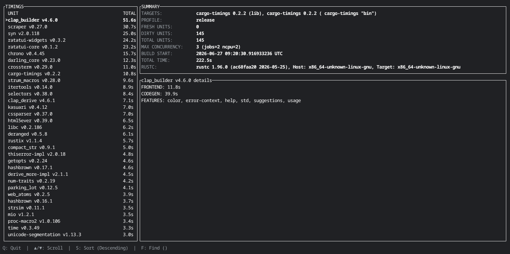

# cargo-timings

Terminal-based visualizer and dashboard for `cargo-timing.html` files, built entirely in Rust.

[](https://crates.io/crates/cargo-timings)



## Installation

```bash
# Installs with the interactive TUI mode by default
cargo install cargo-timings

# Minimal installation (CLI text output only)
cargo install cargo-timings --no-default-features
```

## Usage

First, compile your Rust project using Cargo's built-in timing flag:

```bash
cargo build --timings
```

Then, run the tool inside your project directory:

```bash
# Automatically finds the standard target HTML path and lists bottlenecks
cargo timings

# Filter and search for specific dependencies (e.g., isolate build scripts)
cargo timings --search "build-script"

# Get granular metrics including frontend and codegen stages
cargo timings --detail extended
cargo timings --detail full

# Launch the interactive TUI dashboard
cargo timings -i
```

## Support

You can support development of this project in two ways:

* **Report bugs & Ideas**: Found an issue or want a feature? Report it on [Issue Tracker](https://github.com/Kayen0000/cargo-timings/issues).
* **Donate**: Support ongoing maintenance via [PayPal](https://paypal.me/dominikleszczynski0).

Note: The upstream Rust/Cargo team may alter the structure of cargo-timing.html over time. Active reporting and support ensure this tool stays updated and maintained.
